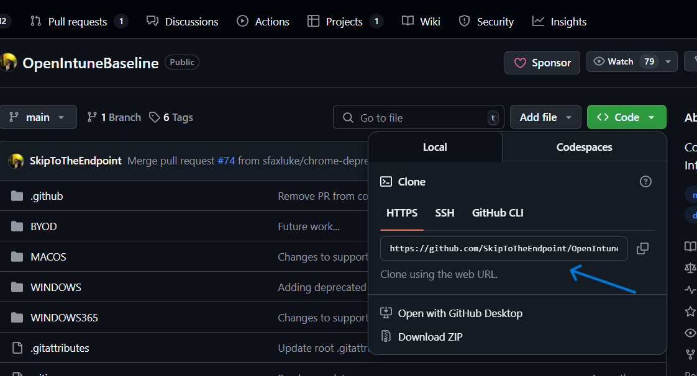
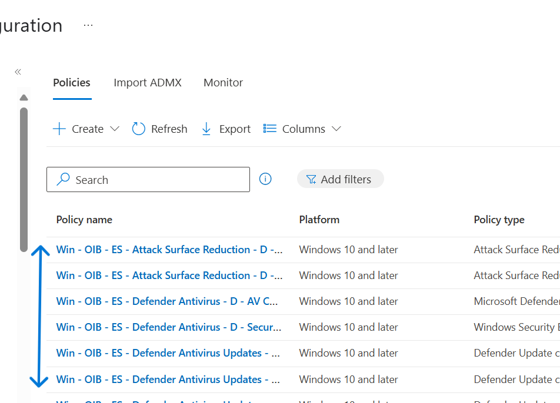

Import Intune Policies Using PowerShell & GitHub (CIS Benchmark)
---

This lab explains how I imported CIS Benchmark-based security policies into Microsoft Intune using PowerShell and VS Code.

**What I Used**

- Microsoft 365 tenant with Intune
- Visual Studio Code
- PowerShell 7
- Git
- Microsoft.Graph PowerShell module

I also used this amazing GitHub repo for hardening policies:
OpenIntuneBaseline by SkipToTheEndpoint

Big thanks to the author — it saved me hours and everything worked cleanly!

### 1. Clone the GitHub Repository
First, Open VS code and connect it with Github. 
Create a folder for projects in VS code. 
Open a new terminal in VS Code and run:

git clone https://github.com/SkipToTheEndpoint/OpenIntuneBaseline.git
cd OpenIntuneBaseline

This downloaded all the scripts and JSON files to my system.

### 2.Connected PowerShell to My Tenant
Connect-MSGraph

This opened a sign-in prompt, and I logged in with my Microsoft 365 admin account.

### 3.Run the Import Script
Navigate into the correct folder and run:

This picked up all the CIS policy templates from the JSON folder and created configuration profiles in Intune.

### 4.Confirm in Intune Portal
Go to:
Intune Admin Center → Devices → Configuration profiles
You should now see several security-focused policies created from the import.

Final Thoughts
This lab demonstrates how to quickly bring security best practices into your Intune environment using trusted public resources.

Again, huge thanks to @SkipToTheEndpoint for sharing these policies.

